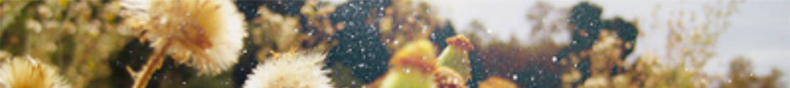
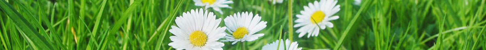
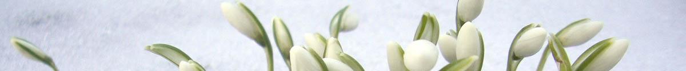

# Parallax Slider #

*Description:* Parallax Slider incorporates a parallax scrolling effect where each slide and its contents glide into view at different speeds, creating a captivating visual experience. The slider is responsive in nature, and supports other nifty features such as manual or automatic mode, stop rotating after x cycles, persistence of the last shown slide, and more.

## Directions ##

*Step 1:* This script uses the following external files:

+ jQuery 1.10 or above (served via Google CDN)
+ parallaxslider.css
+ parallaxslider.js
+ jquery.velocity.min.js
+ jquery.touchSwipe.min.js
+ Images for UI

*Step 2:* Add the below code to the HEAD section of your page:

	<link rel="stylesheet" type="text/css" href="parallaxslider.css" />
	
	
	
	
	
	
	
	

*Step 3:* Then, add the below sample markup to your page:

	

	
	

		

		
A cairn is a man-made pile (or stack) of stones, used as trail markers in many parts of the world. -Wikipedia

		

			

			“Letting go is the lesson. Letting go is always the lesson. Have you ever noticed how much of our agony is all tied up with craving and loss?”  - Susan Gordon Lydon 
			

		

	

	
	

		

		

			
“The things I carry are my thoughts. That's it. They are the only weight. My thoughts determine whether I am free and light or burdened.”   - Kamal Ravikant
			

		

		

			
Cally Lily is a perennial plant, evergreen where rainfall and temperatures are adequate. -Wikipedia
			

		

	

	
	

		

		

			

			“Problems that remain persistently insoluble should always be suspected as questions asked in the wrong way”   Alan Wilson Watts
			

		

	

	
	

		

		

			
		

		

			
		

		

			
		

	

	
	

	
	<a href="javascript:firstparallaxslider.navigate('back')">Back</a> | <a href="javascript:firstparallaxslider.navigate('forth')">Forth</a>

## Parallax Slider set up ##

See script project page for additional details on setup and documentation: <http://www.dynamicdrive.com/dynamicindex17/parallaxslider/index.htm>
